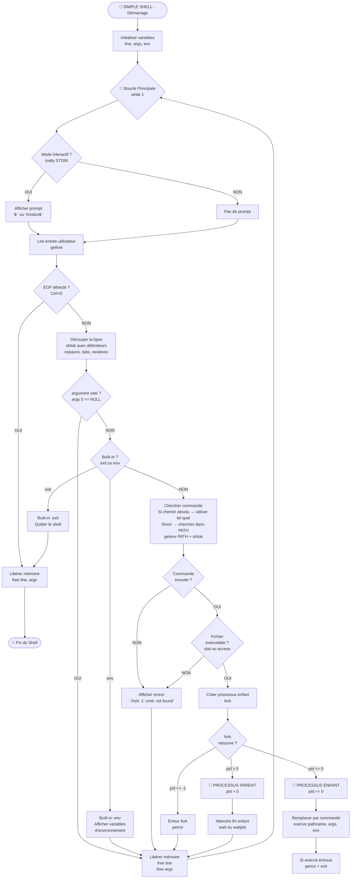

### Key Functions

| File | Function | Description |
|------|----------|-------------|
| `main.c` | `main()` | Main loop: prompt, read input, process commands |
| `main.c` | `get_input_line()` | Reads user input with getline |
| `main.c` | `process_input()` | Tokenizes and executes commands |
| `builtins.c` | `execute_builtin()` | Checks and executes built-in commands |
| `builtins.c` | `builtin_exit()` | Handles exit command |
| `builtins.c` | `builtin_env()` | Handles env command |
| `path.c` | `get_cmd_fullpath()` | Resolves command path using PATH |
| `tokenize.c` | `tokenize_string()` | Splits input into tokens |
| `execute.c` | `execute_command()` | Forks and executes external commands |

## Process Flow



### PATH Resolution

The `get_cmd_fullpath()` function searches for executable commands in the system PATH environment variable.

**Key concepts:**
- `getenv()` - Retrieves PATH environment variable
- `strtok()` - Splits PATH into individual directories
- `stat()` or `access()` - Verifies file exists and is executable
- Returns full path if found, `NULL` otherwise

**Examples:**

```c
// Absolute path - returns immediately
get_cmd_fullpath("/bin/ls", env)  → "/bin/ls" (if exists)

// Relative path - returns immediately  
get_cmd_fullpath("./hsh", env)    → "./hsh" (if exists)

// Command name - searches PATH
get_cmd_fullpath("ls", env)       → "/bin/ls" (found in /bin)

// Invalid command
get_cmd_fullpath("invalid", env)  → NULL (not found)
```

## Testing

### Manual Testing

Use the test script to verify functionality:

```bash
# Test built-ins
echo "exit" | ./hsh
echo "env" | ./hsh

# Test external commands
echo "ls" | ./hsh
echo "ls -la" | ./hsh
echo "/bin/pwd" | ./hsh

# Test error handling
echo "nonexistent" | ./hsh
echo "" | ./hsh
```

### Memory Leak Testing

Verify no memory leaks with Valgrind:

```bash
valgrind --leak-check=full --show-leak-kinds=all ./hsh
# Then type commands and exit
```

Expected result: **"All heap blocks were freed -- no leaks are possible"**

### Comparison with /bin/sh

```bash
# Test your shell
echo "ls -l" | ./hsh > output_hsh.txt

# Test sh
echo "ls -l" | /bin/sh > output_sh.txt

# Compare
diff output_hsh.txt output_sh.txt
```

### Automated Test Suite

Create a file `test_shell.sh`:

```bash
#!/bin/bash

echo "===== SIMPLE SHELL TESTS ====="

# Test 1: Basic commands
echo "Test 1: ls"
echo "ls" | ./hsh

# Test 2: Built-in exit
echo "Test 2: exit"
echo "exit" | ./hsh

# Test 3: Built-in env
echo "Test 3: env"
echo "env" | ./hsh | head -5

# Test 4: Command with arguments
echo "Test 4: ls -l"
echo "ls -l" | ./hsh

# Test 5: Absolute path
echo "Test 5: /bin/pwd"
echo "/bin/pwd" | ./hsh

# Test 6: Command not found
echo "Test 6: nonexistent"
echo "nonexistent" | ./hsh

# Test 7: Empty input
echo "Test 7: empty line"
echo "" | ./hsh

# Test 8: Multiple commands
echo "Test 8: multiple commands"
echo -e "ls\npwd\nexit" | ./hsh

echo "===== TESTS COMPLETE ====="
```

Run with:
```bash
chmod +x test_shell.sh
./test_shell.sh
```

## Allowed Functions and System Calls

- **String functions:** `strlen`, `strcpy`, `strcat`, `strcmp`, `strdup`, `strtok`
- **I/O:** `printf`, `fprintf`, `putchar`, `getline`, `perror`
- **Memory:** `malloc`, `free`
- **Process:** `fork`, `execve`, `wait`, `waitpid`, `exit`, `_exit`
- **File:** `access`, `stat`, `open`, `close`, `read`, `write`
- **Directory:** `opendir`, `readdir`, `closedir`
- **Environment:** `getenv`, `isatty`, `getpid`
- **Other:** `signal`, `kill`, `fflush`

## Requirements

- All code compiled with: `gcc -Wall -Werror -Wextra -pedantic -std=gnu89`
- Betty style compliant
- No memory leaks
- Maximum 5 functions per file
- All header files include guarded

## Known Limitations

- Does not handle command separators (`;`, `&&`, `||`)
- Does not handle pipes (`|`) or redirections (`>`, `<`, `>>`)
- Does not handle wildcards (`*`, `?`)
- Does not handle variables (`$VAR`)
- Does not handle quotes for arguments with spaces
- Does not handle comments (`#`)
- Does not support job control (`Ctrl+Z`, `bg`, `fg`)

## Authors

- **Soufiane Filali** - [GitHub](https://github.com/soufiane-filali)
- **Laurent Lacôte** - [GitHub](https://github.com/llacote-holberton)

## Acknowledgments

- Holberton School for the project guidelines
- Betty style guide contributors
- All peer reviewers and testers

## Technologies Used

<p align="left">
    
    
    
    
    
</p>

## License

This project is part of the Holberton School curriculum. All rights reserved.

---
