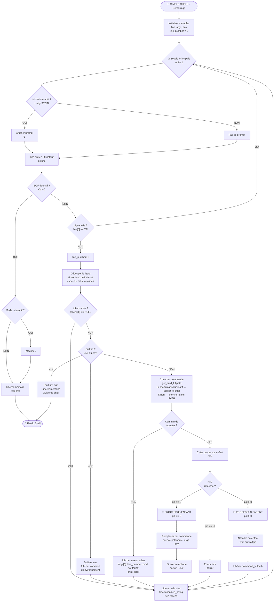

# Simple Shell: Command Line Interface to interact with your OS.

## Summary
Simple Shell is a simple command line interface program under GPL license allowing user to send simple commands to manipulate files and get information on OS.
It supports the most essential features a user could expect: support of user $PATH to find programs, propagation of command arguments,
 error handling, interactive and non-interactive mode.

## How to install and run

In a nutshell: ensure you meet all prerequisites (POSIX compatible system, C language libraries, GCC compilation tools and optionally GDB/Valgrind), download the source code, compile it with gcc (quick example `gcc -std=gnu89 downloaded-code/*.c -o simpleshell`) and run it (`./simpleshell`).

<details>
<summary>(Click for detailed information on prerequisites, download and compilation steps)</b></summary>

### Prerequisites
1. This program can only run properly on a POSIX-compliant operating system with support for the "main envp" extension (in short: any GNU/Linux distribution, Mac OS, or a GNU/Linux distribution installed within Windows Subsystem for Linux). As it relies on POSIX APIs.

2. You must have the packages/tools related to C installed on your system, as well as a "compiler" (program used to "prepare" this tool for your machine).  
In case that would help here are some online resources to install those tools depending on your operating system
  * Windows: please install a Linux distribution using WSL then follow instructions for "installation in Linux" directly within.
  * Mac: https://www.cs.auckland.ac.nz/~paul/C/Mac/
  * Linux (deb package system): https://jvns.ca/blog/2025/06/10/how-to-compile-a-c-program/

### 1. Downloading
If you have git and are comfortable with command line,
  you can simply open one and go to the directory in which you want calculator to be.
  Then run (without the quotes) `"git clone https://github.com/llacote-holberton/holbertonschool-simple_shell.git"`
Otherwise you can simply download a zip containing all projects file
  by following [this url](https://github.com/llacote-holberton/holbertonschool-simple_shell/archive/refs/heads/main.zip)
  then unfolding it where you want on your computer.

### 2. Compiling
Open a terminal, go inside the project directory (the one created from git clone or unzip).
Then type the following command (without quotes if you're reading this as raw text).
Note that you can replace "hsh.out" with any filename you fancy.  
`gcc -Wall -Werror -Wextra -pedantic -std=gnu89 *.c -o hsh.out`  

</details>

## How to use

### Starting program
* For a "one-shot manual execution": open a terminal place yourself in the directory in which you have downloaded/extracted the project then compiled an executable,  
and just type ./<executable-name>  (for example for the "demo executable" it would be `./custom_shell_demo.out`).
* To make it available like any other "personal program", copy it to the conventional folder (should already exist).
  `cp ./<executable-name> ~/.local/bin/`
* Alternatively, if you want to keep it in specific folder but still be able to run it from anywhere, add the folder to your PATH like this.
`echo 'export PATH="/<path-to-folder-containing-exe>:$PATH"' >> ~/.bashrc`

### Usage overview
Once compiled (e.g. as an executable file shs.out) you can manually run it (confer [Starting program](#starting-program) section) to use it in interactive mode.  
Alternatively, you can "pipe" command(s) into it to have it execute them immediately and stop automatically afterwards.
For examples of use in Interactive and Non-Interactive mode, please go to [Examples of use](#examples-of-use)

### Quick tutorial demo
FIXME


## Features and limitations

As this was a short-timed and severely constrained project tailored for pedagogy first, it is simple by design.

### Supported (v1.0)
- Searching for commands using your PATH environment (`ls`, `pwd`, `cp` etc).
- Providing commands with arguments (`ls -latr`, `cp sourcefile filecopy` etc).
- Listing available environments variables (builtin `env` command).
- Exiting through <CTRL>+<D> shortcut or (builtin) `exit` command.
- Propagating regular output of executed commands (including their warnings in case of invalid use).

WARNING: please note that changing directory within the shell is *not* yet supported, as this must necessarily be implemented as a shell built-in and it was outside of the functional scope for our v1.

### Not supported (yet)
None of the following are currently supported. If you need any of them please consider using a full-grade shell instead (such as Bourne Shell aka "bash" which is usually pre-installed on any GNU/Linux distribution).
- Command separators (`;`, `&&`, `||`)
- Pipes (`|`) or redirections (`>`, `<`, `>>`)
- Globbing wildcards (`*`, `?`)
- Variables interpolation (`$VAR`, `$HOME`)
- Quotes for arguments with spaces
- Comments (`#`)
- Job control (`Ctrl+Z`, `bg`, `fg`)

### Accessible help
You can consult the associated help by typing the following command while at the root directory of this project.
`man ./man_1_simple_shell`.

In case you would prefer adding it to your manpages database to have it available "anywhere", you can type in these commands
  (you will need root privileges on your system if you plan on adding for all users by copying to /usr/share/man/man3/).
```
mkdir -p ~/.local/share/man/man1/                      # OPTIONAL: in case it doesn't exist already.
cp ./man_1_simple_shell ~/.local/share/man/man1/hsh.1  # Copy to the right section.
mandb                                                  # Force the reconstruction of manpages index
man 1 hsh                                              # Will now work wherever you are.
```

## Examples of use

<details>
<summary>(Click to expand)</b></summary>

### Valid examples

All following examples describe the "non-interactive" way with shell named 'hsh'. For the interactive one, just start the shell then type what is within the double quotes (ex `echo "ls -latr /tmp | ./hsh"` --> `ls -latr /tmp`).

| Use case                                         | Command line                              |
|--------------------------------------------------|-------------------------------------------|
| Listing content of /tmp, sorted from oldest      | `echo "ls -latr /tmp" | ./hsh`            |
| Showing "where you are"                          | `echo "pwd" | ./hsh`                      |
| Reading a log file                               | `echo "less /var/log/mylog" | ./hsh`      |
| Getting info on your system                      | `echo "uname -a" | ./hsh`                 |

### Failing examples
Couple of use-cases which are not supported.

| Use case                                                                        | Command line                                  |
|---------------------------------------------------------------------------------|-----------------------------------------------|
| Listing the 10 biggest files of my user's home directory (pipes unrecognized)   | `du -h --max-depth=1 | sort -hr | head -n 10` |
| Find C source files in directory tree from "here" (double quotes don't protect) | `find . -name "*.c"`                          |
| Appending an item to a basic tasklist ("appending redirect" unrecognized)       | `echo "tomato sauce" >> shopping_list.txt`    |

</details>

## Technical information

### General architecture
This program relies on reading a stream of text entered by a user either programmatically or from keyboard and terminating with a new line.
It then "cuts" in chunks using space(s) as delimiter(s) to identify a structure consisting of a "command" (first word) and any option/argument accompanying it (the rest).
If at least one word is obtained, it checks if it matches a "builtin command" to run it, or if it matches any command made available through the directories listed in the PATH environment variable. Executing it if found.  
Note that as a result of this architecture, in case of a collision between a builtin and a third-party program the builtin will have precedence (low risk though, we currently only have "env" and "exit").

### Process Flow



For a deep dive into the inner workings and design choices, including PATH resolution and function-level architecture, please read our dedicated [Architecture](./ARCHITECTURE.md) page.

### Memory management
Code has been examined with Valgrind and tested with various use-cases to try and make it as robust as possible (confer [Testing](#testing)) for details.
Here is an example output of Valgrind after ~20 loops of various (supported) commands.
```
==8== 
==8== HEAP SUMMARY:
==8==     in use at exit: 0 bytes in 0 blocks
==8==   total heap usage: 88 allocs, 88 frees, 3,913 bytes allocated
==8== 
==8== All heap blocks were freed -- no leaks are possible
==8== 
==8== For lists of detected and suppressed errors, rerun with: -s
==8== ERROR SUMMARY: 0 errors from 0 contexts (suppressed: 0 from 0)
```

## Testing

### Manual Testing

Use the test script to verify functionality:

```bash
# Test built-ins
echo "exit" | ./hsh
echo "env" | ./hsh

# Test external commands
echo "ls" | ./hsh
echo "ls -la" | ./hsh
echo "/bin/pwd" | ./hsh

# Test error handling
echo "nonexistent" | ./hsh
echo "" | ./hsh
```

### Memory Leak Testing

Verify no memory leaks with Valgrind:

```bash
valgrind --leak-check=full --show-leak-kinds=all ./hsh
# Then type commands and exit
```

Expected result: **"All heap blocks were freed -- no leaks are possible"**

### Comparison with /bin/sh

```bash
# Test your shell
echo "ls -l" | ./hsh > output_hsh.txt

# Test sh
echo "ls -l" | /bin/sh > output_sh.txt

# Compare
diff output_hsh.txt output_sh.txt
```

### Automated Test Suite

Create a file `test_shell.sh`:

```bash
#!/bin/bash

echo "===== SIMPLE SHELL TESTS ====="

# Test 1: Basic commands
echo "Test 1: ls"
echo "ls" | ./hsh

# Test 2: Built-in exit
echo "Test 2: exit"
echo "exit" | ./hsh

# Test 3: Built-in env
echo "Test 3: env"
echo "env" | ./hsh | head -5

# Test 4: Command with arguments
echo "Test 4: ls -l"
echo "ls -l" | ./hsh

# Test 5: Absolute path
echo "Test 5: /bin/pwd"
echo "/bin/pwd" | ./hsh

# Test 6: Command not found
echo "Test 6: nonexistent"
echo "nonexistent" | ./hsh

# Test 7: Empty input
echo "Test 7: empty line"
echo "" | ./hsh

# Test 8: Multiple commands
echo "Test 8: multiple commands"
echo -e "ls\npwd\nexit" | ./hsh

echo "===== TESTS COMPLETE ====="
```

Run with:
```bash
chmod +x test_shell.sh
./test_shell.sh
```
## Project constraints
This shell has been created in respect of the following directives.

### Allowed Functions and System Calls

- **String functions:** `strlen`, `strcpy`, `strcat`, `strcmp`, `strdup`, `strtok`
- **I/O:** `printf`, `fprintf`, `putchar`, `getline`, `perror`
- **Memory:** `malloc`, `free`
- **Process:** `fork`, `execve`, `wait`, `waitpid`, `exit`, `_exit`
- **File:** `access`, `stat`, `open`, `close`, `read`, `write`
- **Directory:** `opendir`, `readdir`, `closedir`
- **Environment:** `getenv`, `isatty`, `getpid`
- **Other:** `signal`, `kill`, `fflush`

### Requirements

- All code compiled with: `gcc -Wall -Werror -Wextra -pedantic -std=gnu89`
- Betty style compliant
- No memory leaks
- Maximum 5 functions per file
- All header files include guarded

## Authors

- **Soufiane Filali** - [GitHub](https://github.com/soufiane-filali)
- **Laurent Lacôte** - [GitHub](https://github.com/llacote-holberton)

## Acknowledgments

- Holberton School for the project guidelines
- Betty style guide contributors
- All peer reviewers and testers

## Technologies Used

<p align="left">
    
    
    
    
    
    
</p>

## License

This project is part of the Holberton School curriculum. All rights reserved.

---
